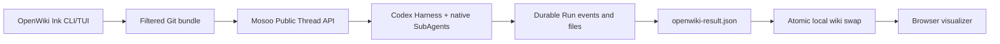

# Architecture overview

OpenWiki preserves its product surface while moving agent execution to Mosoo.

## Ownership

| Behavior | Owner |
| --- | --- |
| CLI/TUI, connector pull, repository filtering, final wiki swap | OpenWiki |
| Codex execution, Skills, native SubAgents, sandbox | Mosoo Agent/Environment |
| Thread, Run, lifecycle events, attachments, artifacts | Mosoo |
| Markdown graph and reader | Existing OpenWiki visualizer |

`src/agent/index.ts` is now a small entrypoint into `src/agent/mosoo.ts`. The latter resolves server-side configuration, snapshots the repository, calls the public Thread API, projects streamed events into `OpenWikiRunEvent`, and applies the returned artifact.

Pure OpenWiki business rules remain local: OKF front matter, Mermaid validation, internal-link validation, `.openwikiignore`, Git/update metadata, CLI parsing, connectors, telemetry, and visualization. The old DeepAgents backend, middleware, provider/model factory, SQLite checkpointing, and local subagent definitions were deleted rather than wrapped.

## State and failure behavior

Mosoo is the durable source for Thread, Run, public lifecycle events, attachments, and artifacts. The current published OpenWiki Agent is a Task (`cattle`) Agent: each generation starts from the attached repository bundle. A failed Run remains inspectable, but its temporary sandbox and native Codex/SubAgent working state are not a resumable checkpoint; retry starts from the beginning by design.

Only a completed Run that publishes `outputs/openwiki-result.json` changes the local wiki. Artifact application stages a complete tree and uses rename-based replacement, restoring the prior wiki if validation or replacement fails.

## Security boundary

- `MOSOO_API_TOKEN` stays in the trusted Node process.
- `.env`, private-key filenames, ignored files, and symlinks escaping the repository are excluded from uploads.
- Uploaded bundles are capped at 64 MiB.
- Artifact paths are normalized and traversal or absolute paths are rejected.
- The browser visualizer only reads the local generated wiki and never receives Mosoo credentials.
